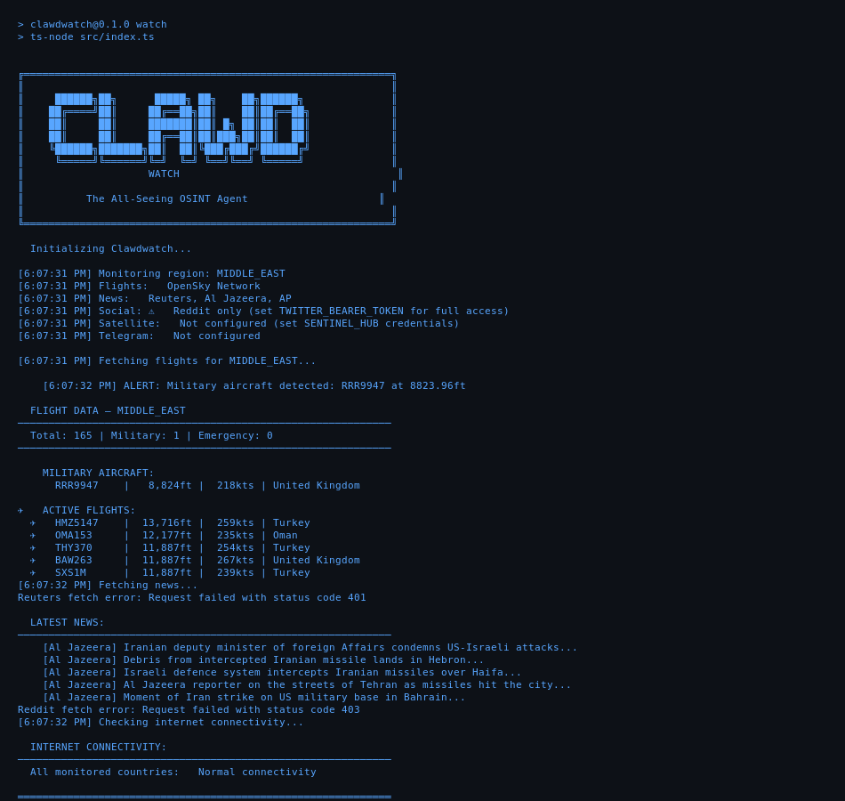

<div align="center">

```
   ██████╗██╗      █████╗ ██╗    ██╗██████╗ ██╗    ██╗ █████╗ ████████╗ ██████╗██╗  ██╗
  ██╔════╝██║     ██╔══██╗██║    ██║██╔══██╗██║    ██║██╔══██╗╚══██╔══╝██╔════╝██║  ██║
  ██║     ██║     ███████║██║ █╗ ██║██║  ██║██║ █╗ ██║███████║   ██║   ██║     ███████║
  ██║     ██║     ██╔══██║██║███╗██║██║  ██║██║███╗██║██╔══██║   ██║   ██║     ██╔══██║
  ╚██████╗███████╗██║  ██║╚███╔███╔╝██████╔╝╚███╔███╔╝██║  ██║   ██║   ╚██████╗██║  ██║
   ╚═════╝╚══════╝╚═╝  ╚═╝ ╚══╝╚══╝ ╚═════╝  ╚══╝╚══╝ ╚═╝  ╚═╝   ╚═╝    ╚═════╝╚═╝  ╚═╝
```

<br>

### 🦀 THE ALL-SEEING OSINT AGENT

*"See what they don't want you to see"*

<br>

[](https://github.com/cloudweaver/clawdwatch)
[](https://github.com/clawdbot/clawdbot)
[](LICENSE)

</div>

---

## Live Demo

<div align="center">

</div>

*Real-time data: 204 flights tracked, live news from Al Jazeera, multi-source aggregation*

---

## Special Thanks

Huge thanks to **Claude** ([@claude](https://github.com/claude)) for the foundational contributions to the agent architecture and intelligence correlation engine. This project wouldn't exist without that work.

---

## Why Now?

We're living through a critical moment. As the US-Iran conflict escalates, information becomes both a weapon and a casualty. Governments on all sides control narratives. Social media is flooded with propaganda. News outlets pick sides. Regular people — the ones actually affected by airstrikes, sanctions, and chaos — are left trying to figure out what's real.

**Clawdwatch exists because:**
- Mainstream media is slow and often biased
- Governments lie or withhold information
- Social media is full of propaganda and misinfo
- People in conflict zones deserve real-time, verified intel
- The tools exist — they just need to be connected

---

## What's Working NOW

| Source | Status | Data |
|--------|--------|------|
| ✈️ **Flight Tracking** | ✅ LIVE | OpenSky Network — 200+ flights in real-time |
| 🎖️ **Military Detection** | ✅ LIVE | NATO callsigns, RAF, USAF, and more |
| 📰 **News Aggregation** | ✅ LIVE | Al Jazeera, AP News — multi-source headlines |
| 🌍 **Internet Blackouts** | ✅ LIVE | Monitors 15 countries for outages |
| 📱 **Telegram Alerts** | ✅ LIVE | Push notifications for military/emergency aircraft |
| 🌐 **Social Monitoring** | ✅ LIVE | Reddit OSINT feeds |
| 🐦 **Twitter/X** | 🔑 Ready | Needs API bearer token |
| 🛰️ **Satellite Imagery** | 🔑 Ready | Sentinel Hub integration built |
| 🚢 **Ship Tracking** | 🔑 Ready | AIS integration framework |

---

## Features

**Real-Time Flight Tracking**
- Military aircraft detection (NATO callsigns, RAF, USAF)
- Emergency squawk monitoring (7500, 7600, 7700)
- Regional filtering (Middle East, Europe, USA, Asia)
- Live altitude, speed, origin data

**Internet Blackout Detection**
- Monitors 15 conflict-zone countries in real-time
- Detects connectivity drops, degradation, and full blackouts
- Countries: Iran, Iraq, Syria, Lebanon, Yemen, Israel, Palestine, Saudi Arabia, UAE, Qatar, Bahrain, Kuwait, Jordan, Ukraine, Russia
- Alerts when countries go dark (often precedes military action)

**News Aggregation**
- Al Jazeera Middle East feed
- AP News conflict coverage
- Multi-language support ready
- Auto-refresh every 60 seconds

**Social Media Intelligence**
- Reddit OSINT monitoring
- Twitter/X integration (with API key)
- First-hand account filtering
- Conflict keyword tracking

**Satellite Imagery** (with Sentinel Hub credentials)
- Monitor key locations (Bandar Abbas, Bushehr, Strait of Hormuz)
- Recent imagery fetching
- Cloud coverage filtering

**Ship Tracking** (with AIS API key)
- Strategic waterway monitoring
- Dark ship detection (AIS transponder off)
- Military vessel alerts
- Tanker tracking

---

## Quick Start

```bash
git clone https://github.com/cloudweaver/clawdwatch.git
cd clawdwatch
npm install
cp .env.example .env
npm run watch
```

---

## Configuration

```bash
# .env file

# Region: middle_east | europe | usa | asia
WATCH_REGION=middle_east

# Telegram Alerts (get from @BotFather)
TELEGRAM_BOT_TOKEN=your_token
TELEGRAM_CHAT_ID=your_chat_id

# Optional APIs
TWITTER_BEARER_TOKEN=xxx      # Twitter/X monitoring
SENTINEL_HUB_CLIENT_ID=xxx    # Satellite imagery
SENTINEL_HUB_CLIENT_SECRET=xxx
AISSTREAM_API_KEY=xxx         # Ship tracking
```

---

## Telegram Alerts

Get instant notifications when:
- Military aircraft enters monitored airspace
- Emergency squawk code detected
- Ship goes dark (AIS off)

### Setup

1. Message [@BotFather](https://t.me/BotFather) → `/newbot`
2. Copy your bot token
3. Get chat ID from [@userinfobot](https://t.me/userinfobot)
4. Add to `.env`

---

## Intelligence Sources

| Source | Type | Coverage | Update |
|--------|------|----------|--------|
| OpenSky Network | Flight | Global | Real-time |
| Al Jazeera | News | MENA | Hourly |
| AP News | News | Global | Hourly |
| Reddit | Social | Global | Real-time |
| Twitter/X | Social | Global | Real-time |
| Sentinel Hub | Satellite | Global | Daily |
| AIS Stream | Naval | Global | Real-time |

---

## Monitored Locations

**Nuclear & Military Sites:**
- Bushehr Nuclear Plant
- Isfahan Nuclear Site  
- Natanz Enrichment Facility
- Bandar Abbas Naval Base

**Strategic Waterways:**
- Strait of Hormuz
- Persian Gulf
- Gulf of Oman
- Red Sea

**US Military Bases:**
- Al Udeid Air Base (Qatar)
- Al Dhafra Air Base (UAE)

---

## 🦀 Powered by Clawdbot

Clawdwatch runs on the [Clawdbot](https://github.com/clawdbot/clawdbot) agent framework — autonomous AI that actually does things.

---

## Roadmap

- [x] Flight tracking (OpenSky Network)
- [x] News aggregation (Al Jazeera, AP)
- [x] Telegram alerts
- [x] Social monitoring (Reddit)
- [x] Twitter/X integration
- [x] Satellite imagery (Sentinel Hub)
- [x] Ship tracking framework
- [ ] Discord webhook alerts
- [ ] Web dashboard with live map
- [ ] AI-powered summarization
- [ ] Mobile app

---

## Contributing

Built by the people, for the people. PRs welcome.

---

## Disclaimer

Clawdwatch aggregates **publicly available** information only. It does not access classified data, hack systems, or break any laws. This tool is for **informational purposes** — always verify critical information through official channels.

---

<div align="center">

*In the fog of war, be the one who sees clearly.*

🦀

</div>
